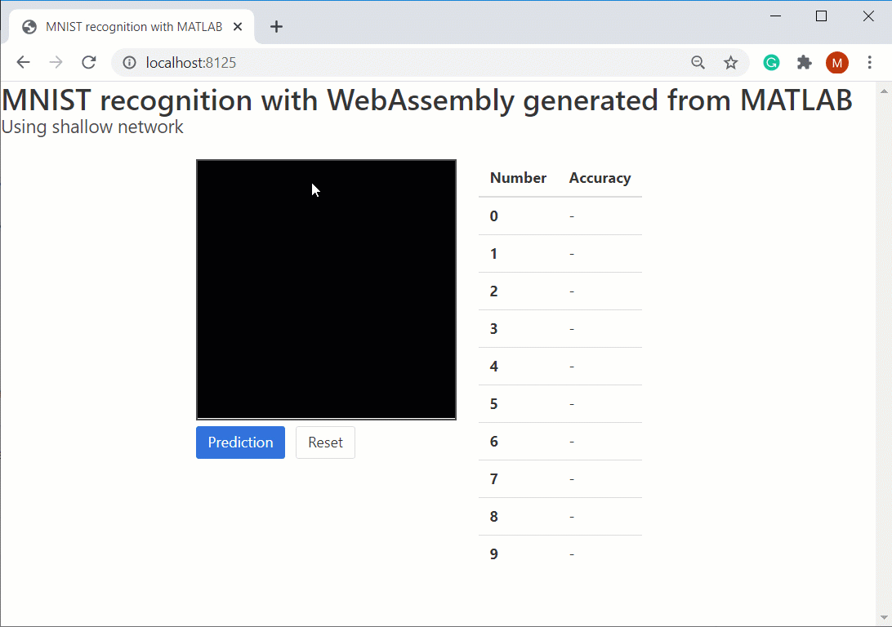

# Predicting handwritten digits
Copyright (c) 2020 Michio Inoue

This is a practice mini-project to learn HTML, JavaScript, and WebAssembly.
日本語解説は[こちら](doc_jp/MATLAB2WebAssembly.md)

MATLAB's classical neural net is implemented as a form of WebAssembly, through "Generate JavaScript Using MATLAB Coder" version 2.0.2 by Geoff McVittie. The tool allows you to create JavaScript/WebAssembly libraries from MATLAB projects using MATLAB Coder.

You can find the tool here:
https://jp.mathworks.com/matlabcentral/fileexchange/69973-generate-javascript-using-matlab-coder

- Step 1: Draw a digit 
- Step 2: Click [Prediction]

**Please note that the current version produces very low accurate results.**

The HTML is based on https://github.com/yukagil/tfjs-mnist-cnn (Thank you!)

# ToDo
1. Documentation.
1. Update the predictive model. The current network has only one hidden layer and trained with 500 digit images only.
2. Try other algorithms (eg. HOG + SVM).
