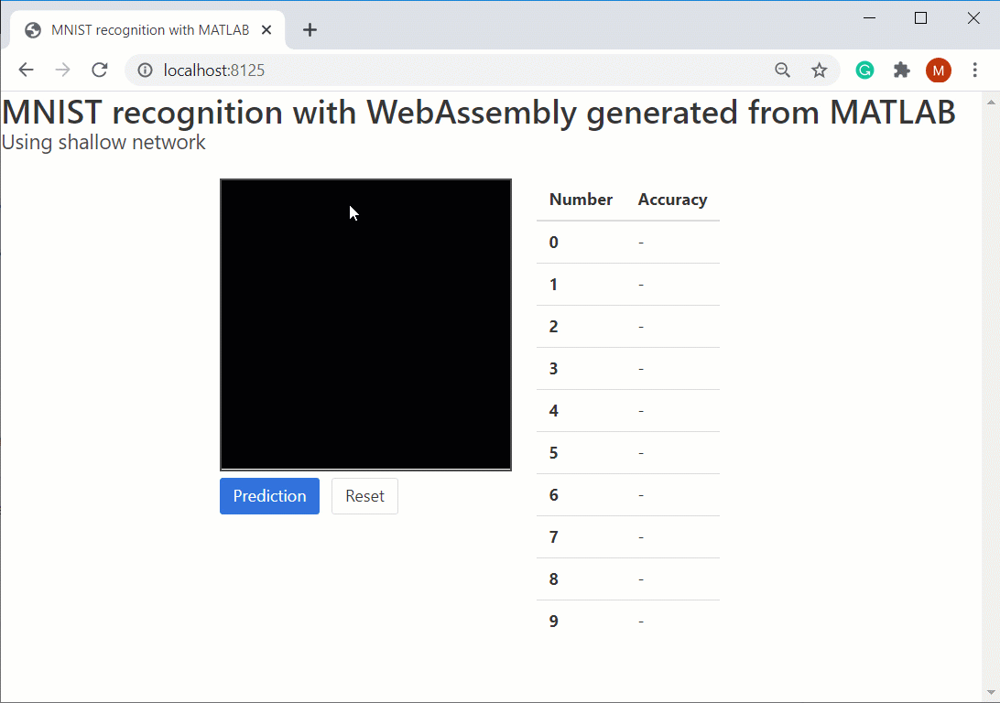
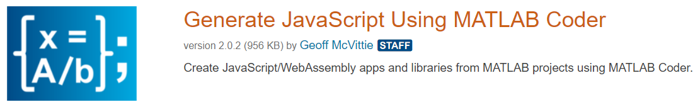
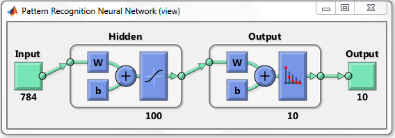
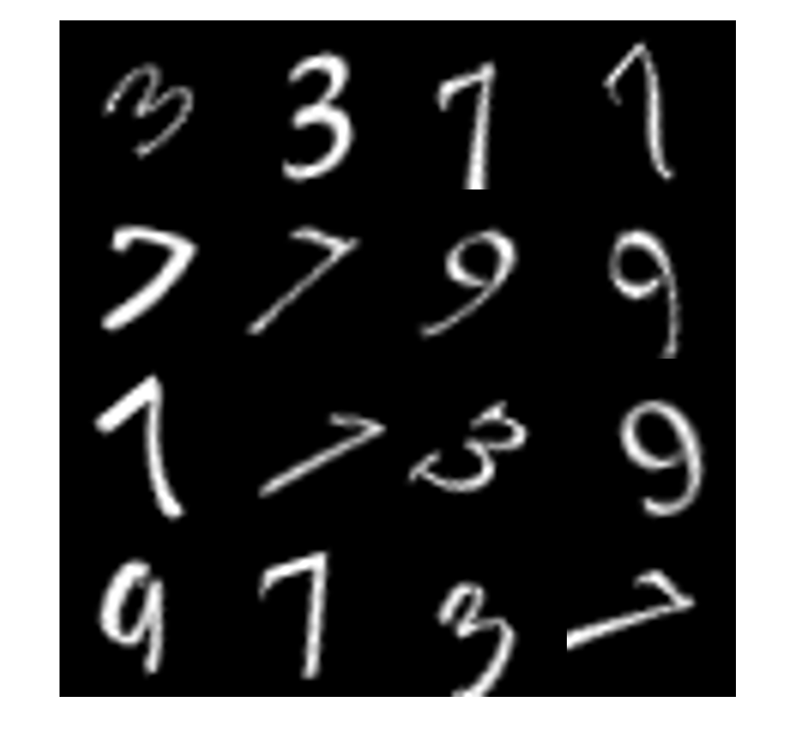
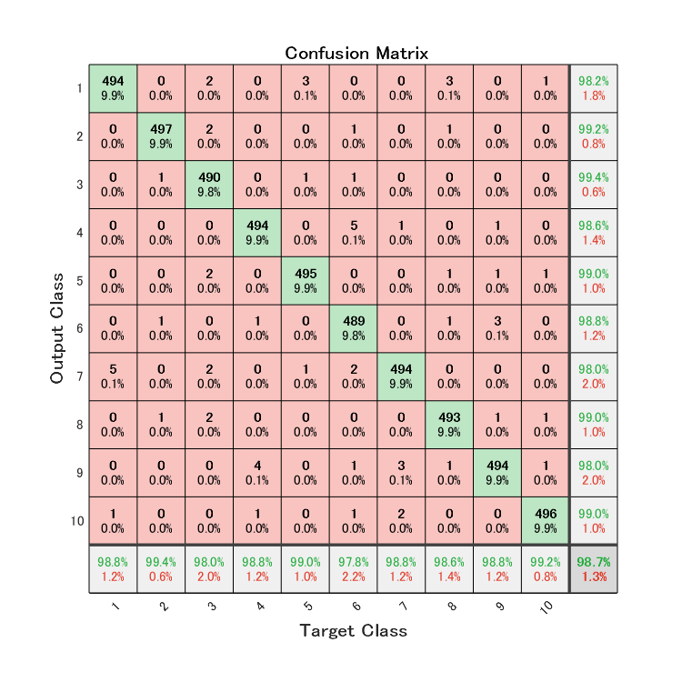
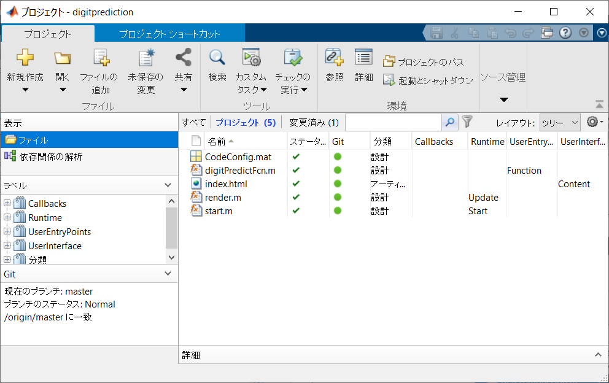
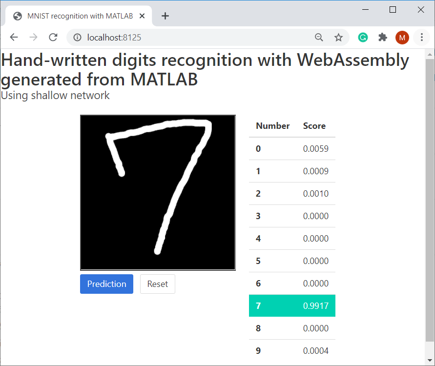

# MATLAB のニューラルネットをブラウザで動かす: MATLAB > C++ > WebAssembly の自動変換
# 0. はじめに


MATLAB をブラウザ実装したら面白そうなものないかなぁ・・と思っていたら、


[TensorFlow.jsでMNIST学習済モデルを読み込みブラウザで手書き文字認識をする](https://qiita.com/yukagil/items/ca84c4bfcb47ac53af99)


こんな素晴らしい記事が見つかったので、マネをしてみました。この記事では TensorFlow.js でWebブラウザ上で書いた数字が0\textasciitilde{}9のどれかを予測していますが、この予測部分に MATLAB のニューラルネットを使ってみた、というお話。


  
# やったこと


コードこちらから： [GitHub: minoue-xx/handwritten-digit-prediction-on-browser](https://github.com/minoue-xx/handwritten-digit-prediction-on-browser)


実行ページはこちら：[Github Pages: Hand-written Digit Prediction on Browser](https://minoue-xx.github.io/handwritten-digit-prediction-on-browser/)


  


予測精度は怪しいですが、ここではまず動くものを、、と単純なネットワークを学習して GitHub Pages に実装するまでのステップを解説する記事です。





  
# WebAssembly 変換？


[MATLAB -> C++ -> WebAssembly の自動変換を使った非線形最適化 on JavaScript](https://qiita.com/eigs/items/68cdcec7b8d56a5b440f)


では [fmincon 関数](https://jp.mathworks.com/help/optim/ug/fmincon.html)を使った最適化をブラウザ実装しましたが、同じ方法を使います。


  


[File Exchange](https://jp.mathworks.com/matlabcentral/fileexchange/) に公開されている [Generate JavaScript Using MATLAB Coder](https://jp.mathworks.com/matlabcentral/fileexchange/69973-generate-javascript-using-matlab-coder) というツールで、MATLAB Coder を使って MATLAB から WebAssembly に変換して実装します。





基本的には Generate JavaScript Using MATLAB Coder で用意されている  [例題: Pass Data to a Library](https://viewer.mathworks.com/?viewer=live_code&url=https%3A%2F%2Fjp.mathworks.com%2Fmatlabcentral%2Fmlc-downloads%2Fdownloads%2Fbd0e1def-822e-40bc-8a7f-5842c7197c5e%2Fe7abd4d2-be59-4ad2-858e-3f1046727acf%2Ffiles%2Fexamples%2FcreateLibrary%2FPassingDataArray.mlx&embed=web) の流れに沿って作業しています。


  
## 環境

   -  MATLAB (R2019b Update 5) 
   -  Deep Learning Toolbox 
   -  MATLAB Coder 
   -  Image Processing Toolbox（[montage 関数](https://jp.mathworks.com/help/images/ref/montage.html) による表示のみ） 
   -  Statistics and Machine Learning Toolbox（[tabulate 関数](https://jp.mathworks.com/help/stats/tabulate.html) によるデータ数集計のみ） 
   -  [File Exchange: Generate JavaScript Using MATLAB Coder](https://jp.mathworks.com/matlabcentral/fileexchange/69973-generate-javascript-using-matlab-coder) v2.0.2 
   -  [Emscripten Development Kit](https://emscripten.org/index.html) v1.39.1 

  
# 1. ツールの設定


基本的には [MATLAB -> C++ -> WebAssembly の自動変換を使った非線形最適化 on JavaScript](https://qiita.com/eigs/items/68cdcec7b8d56a5b440f) と同じステップを踏みます。


File Exchange から [Generate JavaScript Using MATLAB Coder](https://jp.mathworks.com/matlabcentral/fileexchange/69973-generate-javascript-using-matlab-coder) をインストール。まず開く `Setup.mlx` に従って Emscripten Development Kit の最新版をインストールします。ネットワークフォルダだとうまくいかなかったので、ローカルにインストールください。


  
# 2. MATLAB Project 作成


Generate JavaScript Using MATLAB Coder では [MATLAB Project](https://jp.mathworks.com/help/matlab/projects.html) を使用します。


作業フォルダ（[trainingModels/generateWebAssembly](https://github.com/minoue-xx/handwritten-digit-prediction-on-browser/tree/master/trainingModels/generateWebAssembly)）に移動して、以下を実行。出力形式は Dynamic Libeary (dll) です。


```matlab
proj = webcoder.setup.project("digitprediction","Directory",pwd,"OutputType",'dll');
```
  
# 3. MATLAB 関数作成


非線形最適化を実施する関数 `digitPredictionFcn.m` を作ります。まずは単純に隠れ層が１層だけの”浅い”ネットワークでやってみます。


   -  Step 1: データ読み込み 
   -  Step 2: 学習 
   -  Step 3: モデルの MATLAB 関数化 
   -  Step 4: コード生成用に微修正 





学習ステップはこちらを参考にしました: [MathWorks Blog: Artificial Neural Networks for Beginners](https://blogs.mathworks.com/loren/2015/08/04/artificial-neural-networks-for-beginners/)


## Step 1: データ読み込み
```matlab
%% サンプルデータ読み込み（Deep Learning Toolbox に入っているデータです）
[XTrain,YTrain,anglesTrain] = digitTrain4DArrayData;
classNames = categories(YTrain);
numClasses = numel(classNames);
numObservations = numel(YTrain);
whos XTrain
```
```
  Name         Size                      Bytes  Class     Attributes

  XTrain      28x28x1x5000            31360000  double              
```


28x28 のモノクロ画像が 5000 枚入っていますね。


```matlab
montage(XTrain(:,:,:,1:16))
```




こんな画像です。以下の通り各ラベル（数字）につき 500 枚の画像が用意されています。


```matlab
tabulate(YTrain)
```
```
  Value    Count   Percent
      0      500     10.00%
      1      500     10.00%
      2      500     10.00%
      3      500     10.00%
      4      500     10.00%
      5      500     10.00%
      6      500     10.00%
      7      500     10.00%
      8      500     10.00%
      9      500     10.00%
```
## Step 2: 学習


この辺は [MathWorks Blog: Artificial Neural Networks for Beginners](https://blogs.mathworks.com/loren/2015/08/04/artificial-neural-networks-for-beginners/) にある通りアプリでもできます。以下はアプリから吐き出した MATLAB コードをほぼそのまま流用。


```matlab
outputs = dummyvar(YTrain);       % convert label into a dummy variable
outputs = outputs';               % transpose dummy variable
inputs = reshape(XTrain,28*28,5000);

rng(1); % 再現性確保のため乱数初期化

x = inputs;
t = outputs;
trainFcn = 'trainscg';  % Scaled conjugate gradient backpropagation.

% Create a Pattern Recognition Network
hiddenLayerSize = 100;
net = patternnet(hiddenLayerSize, trainFcn);

% Setup Division of Data for Training, Validation, Testing
net.divideParam.trainRatio = 70/100;
net.divideParam.valRatio = 15/100;
net.divideParam.testRatio = 15/100;

% Train the Network
[net,tr] = train(net,x,t);
```


混同行列を書いてみると悪くない結果です。詳細はひとまず問いません。


```matlab
plotconfusion(t,net(x))
```



## Step 3: モデルの MATLAB 関数化


学習したネットワーク `net` をコード生成にもっていくために MATLAB 関数に変換します。


```matlab
genFunction(net, 'digitPredictFcn');
```
```
 
MATLAB function generated: digitPredictFcn.m
To view generated function code: edit digitPredictFcn
For examples of using function: help digitPredictFcn
 
```
```matlab
% edit digitPredictFcn
```


こんな感じで `digitPredictionFcn.m` 、ネットワークの重みも情報も全部書き出した関数ファイルが出来上がります。


  
## Step 4: コード生成用に微調整


残念ながら・・ここでできた関数ではコード生成に対応していない書き方が混ざっていたので、 C++ に自動変換するには少し手を入れる必要がありました。出来上がったものはこちら: GitHub: [digitPredictFcn.m](https://raw.githubusercontent.com/minoue-xx/handwritten-digit-prediction-on-browser/master/trainingModels/generateWebAssembly/digitPredictFcn.m)。


  
### Step 4-1: 関数定義、アサーション
```matlab
function [Y,Xf,Af] = digitPredictFcn(X,~,~) 
```


と定義されていますが、以下の通りシンプルに１入力１出力の関数にします。


```matlab
function YY = digitPredictFcn(XX)
```


また、コード生成用に入力引数のサイズを明記しておく必要があるので、


```matlab
assert(isa(XX, 'double'));
assert(all( size(XX) == [ 28*28, 1 ]));
```


を冒頭に追記します。


  
### Step 4-2: インメモリ処理
```matlab
X = {X}
```


double 型をセル配列に置き換えるこんな処理はダメみたいです。


```matlab
% Format Input Arguments
isCellX = iscell(XX);
if ~isCellX
  X = {XX};
end
```


入力を変数 `XX` としセル配列にしたものを `X` に。この後はそのまま。


  
### Step 4-3: cell2mat 関数


予測結果がセル配列 Y で帰ってきて、最後に double 型に変換していますが、cell2mat 関数はコード生成対象外。


```matlab
Y = cell2mat(Y);
```


ここは乱暴な気もしますが入力として入ってくる変数サイズは決まっているので、


```matlab
YY = Y{:};
```


と置き換えて、`YY` を出力変数とします。


  


関数ができたら、`digitPredictFcn.m` をプロジェクトに追加して、ラベルを UserEntryPoints > Function に設定しておきます。





こんな感じ。


  
# 4. JavaScript と WebAssembly の生成


以下のコードで MATLAB Project からビルドします。裏で MATLAB Coder + Emscripten SDK が走ります。


```matlab
proj = openProject(pwd);
webcoder.build.project(proj);
```
```
コードの生成が成功しました:レポートの表示
```


無事に終了すると、C++ コードが build フォルダに出力されます。さらに、この C++ コードが `digitprediction.js` と `digitprediction.wasm` にコンパイルされて、dist フォルダに出力されます。


  
# 5. HTML/JavaScript から呼び出し


さて、ようやく本題。MDN によると


> JavaScript typed arrays are array-like objects and provide a mechanism for accessing raw binary data.


とのことで、この JavaScript typed arrays を使って、JavaScript から optimizeposition.wasm とデータをやり取りします。


  
## 処理の流れ

   1.  JavaScript typed array を作成 
   1.  typed array の要素数から必要な領域を計算、wasm 側のメモリを確保 
   1.  確保した領域に typed array の値をコピー 
   1.  wasm 側の計算処理を実行 
   1.  wasm 側のメモリから typed array に値をコピー 
   1.  不要になった領域を解放 


1-3 の処理をしているのが `_arrayToHeap`、5 が `_heapToArray `です。処理の詳細は [Guthub: Planeshifter/emscripten-examples](https://github.com/Planeshifter/emscripten-examples/tree/master/01_PassingArrays) の README.md の記述が参考になります。


  
```matlab
    function getAccuracyScores(imageData) {

      let inputs = [];
      let length = 28 * 28; // ピクセルサイズ

      for (let i = 0; i < length * 4; i = i + 4) { // 必要なピクセルだけ取り出します
        inputs.push(imageData.data[i] / 255);
      }
      console.log(inputs); // 確認

      var Inputs = new Float64Array(inputs);
      var Outputs = new Float64Array(10);

      // Move Data to Heap var
      var Inputsbytes = _arrayToHeap(Inputs);
      var Outputsbytes = _arrayToHeap(Outputs);

      // Run Function
      Module._digitprediction_initialize();
      Module._digitPredictFcn(Inputsbytes.byteOffset, Outputsbytes.byteOffset)
      Module._digitprediction_terminate();

      // Copy Data from Heap 
      Outputs = _heapToArray(Outputsbytes, Outputs);
      var outputs = Array.from(Outputs);

      // Free Data from Heap 
      _freeArray(Inputsbytes);
      _freeArray(Outputsbytes);

      // Display Results
      console.log(outputs);
      const score = outputs;
      return score;
    }
```
## 6. 結果をみてみよう


ローカルサーバを立てて結果をみてみます。Fetch API は file URI Scheme をサポートしていないため、ファイルに http URI Scheme でアクセスできるようにする必要があるらしい。Generate JavaScript Using MATLAB Coder には関数が用意されてますのでこれを使います。


先ほど `.js` と `.wasm` が出力されたフォルダ dist に index.html を置きます。MATLAB 上で dist をカレントフォルダにして、


```matlab
server = webcoder.utilities.DevelopmentServer("Port",8125);
start(server);
```
```
Development Server serving directory '.' at locations:
    http://10.0.1.14:8125
    http://localhost:8125
```
```matlab
% サーバを落とすときは
% stop(server);
```





計算はできている模様。ひとまずめでたしめでたし。


  
# まとめ


ひとまず MATLAB で書いたネットワークが JavaScript から正しく呼び出せていることが確認できました。


ただ・・・実際に [Github Pages: Hand-written Digit Prediction on Browser](https://minoue-xx.github.io/handwritten-digit-prediction-on-browser/) から試してみるとわかる通り、精度はいまいち。入力パッドから入っている画像が、学習に使用した画像と性質が異なるのか・・そもそも 5,000 枚しかなかったのが原因なのか？この辺についてはまた次回取り組んでみます。


