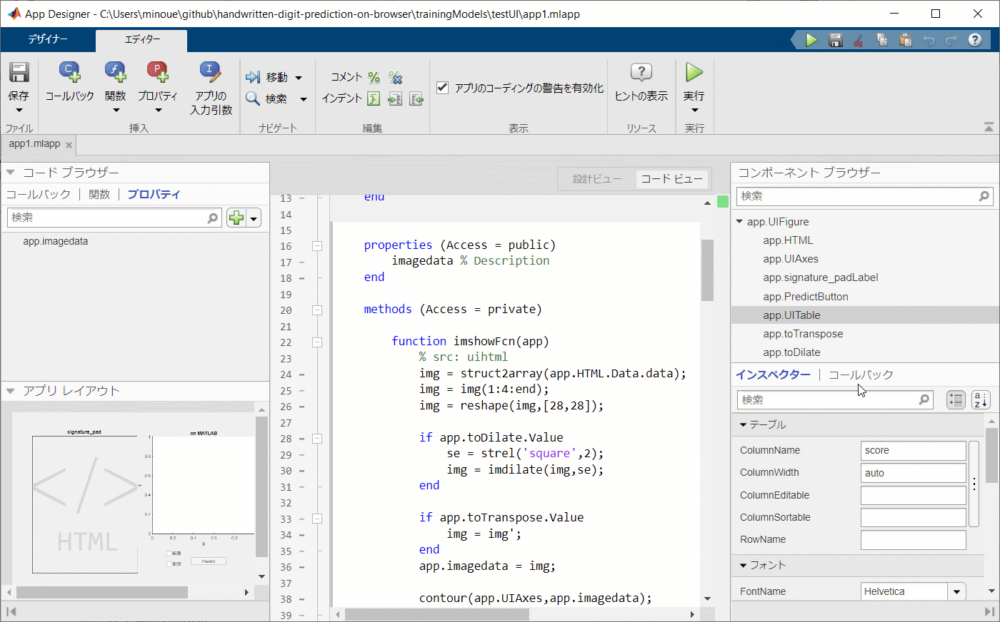
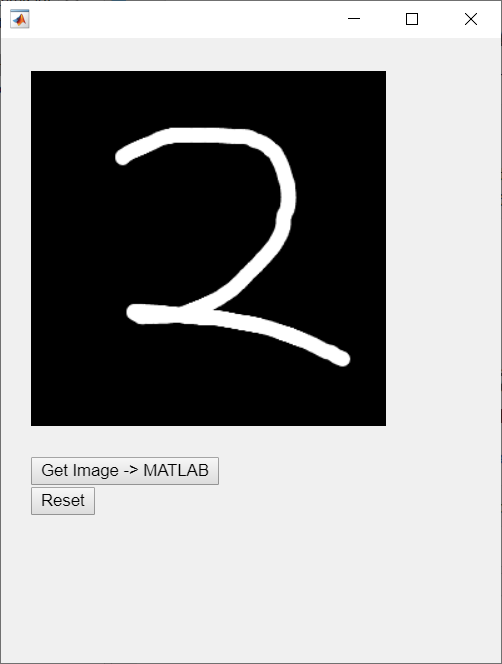
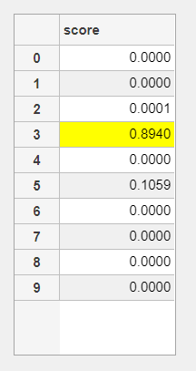
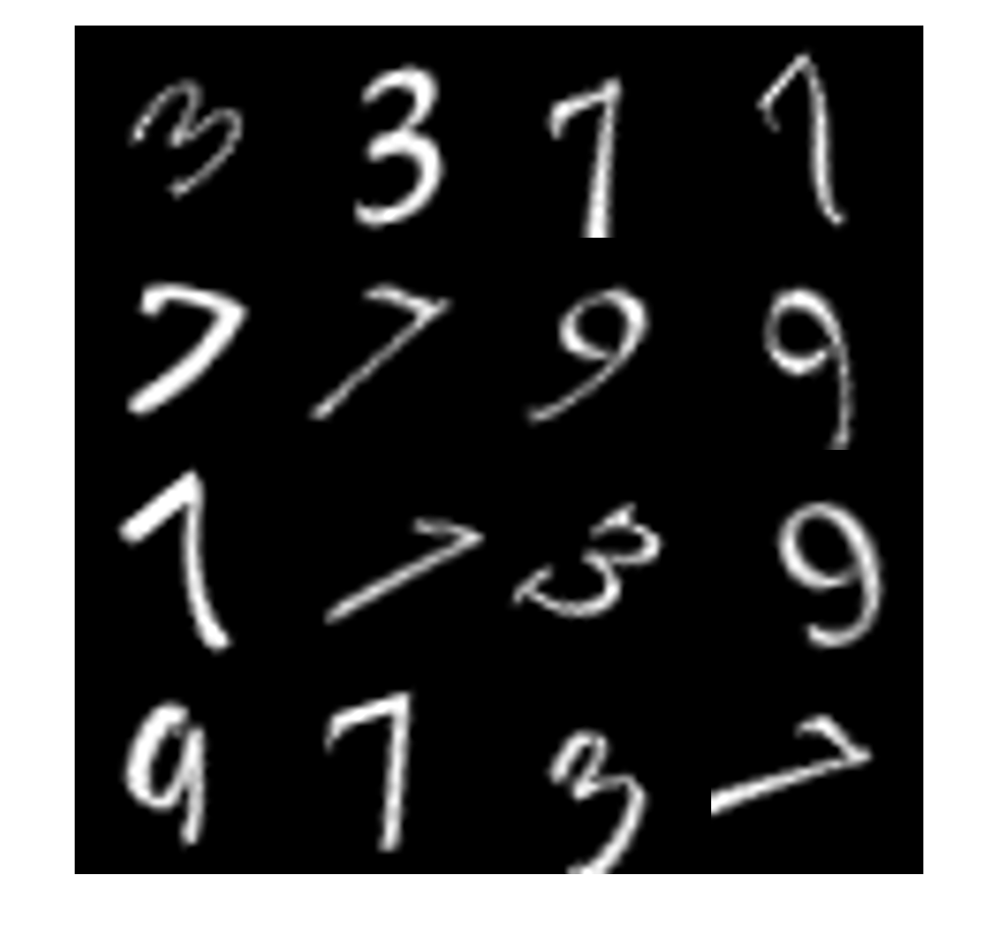

# MATLAB のニューラルネットをブラウザで動かす：JavaScript を App Designer でデバッグ
# 1. はじめに


前回、ブラウザ上で手書き文字の認識を行ってみましたが、精度がいまいちなので結果として「数字を正しく認識させる」ゲームとなってしまっていました（笑）試してみたい方はこちらからどうぞ。[Github Pages: Hand-written Digit Prediction on Browser](https://minoue-xx.github.io/handwritten-digit-prediction-on-browser/)


参照：[MATLAB のニューラルネットをブラウザで動かす: MATLAB > C++ > WebAssembly の自動変換](https://qiita.com/eigs/items/48e782baf3ae617190cb) 


## 精度が悪い理由？


もちろん学習画像では悪くない分類精度でした。なので学習に使った手書き文字画像と、ブラウザ上で書かれる手書き画像の特徴が違うんだろうなと推測。ただ JavaScript 側での画像データの確認は自分には大変難しい・・。


今度は JavaScript (HTML) を MATLAB 側で実行させ、 signiture_pad で作られる手書き文字画像が MATLAB 側でどう認識されているかを確認するアプリを使いました。


  
# 2. やったこと


コードこちらから： [GitHub: minoue-xx/handwritten-digit-prediction-on-browser/trainingModels/testUI](https://github.com/minoue-xx/handwritten-digit-prediction-on-browser/tree/master/trainingModels/testUI)





こんな具合です。


実際にプロットしてみると


   -  転置画像・・ 
   -  学習に使った画像より線が細い 


という特徴がありました。転置を修正してやると精度は向上しそう（それでもダメな場合もありますが）


## 環境

   -  MATLAB (R2019b Update 5) 
   -  Image Processing Toolbox 
   -  Deep Learning Toolbox （学習画像の表示のみに使用） 


予測モデルは前回（[MATLAB のニューラルネットをブラウザで動かす: MATLAB > C++ > WebAssembly の自動変換](https://qiita.com/eigs/items/48e782baf3ae617190cb) ）作成したものを使います。（`digitPredictFcn.m`）


  
# 3. JavaScript を MATLAB のアプリ上で使う


[`uihtml`](https://jp.mathworks.com/help/matlab/ref/uihtml.html) （HTML UI コンポーネント）を使います。こんな感じで HTML のソースファイルを指定するとブラウザ上と同じ機能をアプリ上で再現できます。


signature_pad に使うライブラリ（[https://cdnjs.cloudflare.com/ajax/libs/signature_pad/1.5.3/signature_pad.min.js](https://cdnjs.cloudflare.com/ajax/libs/signature_pad/1.5.3/signature_pad.min.js)）はローカルに落としておきます。


```matlab:Code
fig = uifigure('Position', [100,100,400,500]);
h = uihtml(fig);
h.HTMLSource = fullfile(pwd,'index.html');
h.Position = [25,25,350,450];
```





ここで使った HTML は前回使ったものから要素だけ取り出したもの。ToDo: 詳細はこちら


（html の中身）


  
# 3. JavaScript 側のデータを MATLAB に


[JavaScript でのデータ変化に対する MATLAB の応答のコーディング](https://jp.mathworks.com/help/matlab/ref/uihtml.html#mw_670c2675-8aa8-49fc-94e8-84d2c39fcde1)（公式ページ）を参考にします。


## 3-1. JavaScript 側の設定

```matlab:Code(Display)
function setup(htmlComponent) {
      document.getElementById("getImageData").addEventListener("click", function (event) {
        htmlComponent.Data = getImageData();
      });
      document.getElementById("reset").addEventListener("click", function (event) {
        reset()
      });
    }
```


こんな感じ。`htmlComponent.Data` にデータを入れてやります。そうすると配列であれば構造体配列としてデータが確保され、MATLAB 側では uihtml オブジェクト（`app.HTML`）の `Data` プロパティに値が入ります。


## 3-2. MATLAB (App Designer) 側の設定


あとは `app.HTML.Data.data` を参照してやれば画像データをいじれる（以下は表示など）という話。App Designer だとこのように記載します。


```matlab:Code(Display)
function imshowFcn(app)
    % src: uihtml
    img = struct2array(app.HTML.Data.data);
    img = img(1:4:end);
    img = reshape(img,[28,28]);
    
    if app.toDilate.Value % 画像を膨張させるなら
        se = strel('square',2);
        img = imdilate(img,se);
    end
    
    if app.toTranspose.Value % 転置するなら
        img = img';
    end
    app.imagedata = img;
    
    contour(app.UIAxes,app.imagedata);
end
```


そして、この `imshowFcn` 関数を `app.HTML.Data.data` が更新された（新しい画像が確保された）時に実行させるために、`uihtml` オブジェクトの `DataChangedFcn` として `imshowFcn` 関数を指定しておけばOK。


`startupFcn` にこのように記載します。


```matlab:Code(Display)
function startupFcn(app)
    app.HTML.HTMLSource = fullfile(pwd,'index.html');
    app.HTML.DataChangedFcn = @(src,event) imshowFcn(app);
    
    app.UIAxes.YDir = 'reverse';
    app.UIAxes.XTick = [];
    app.UIAxes.YTick = [];
    app.UIAxes.LineWidth = 2;
    
    app.toTranspose.ValueChangedFcn = @(src,event) imshowFcn(app);
    app.toDilate.ValueChangedFcn = @(src,event) imshowFcn(app);
end
```


あと転置するかどうか、画像を膨張させる（`imdilate`）かどうかのチェックボックスを付ければ完成。


  
# 4. その他


予測結果で最も score の高い位置を黄色で表示していますが、これには [`AddStyle`](https://jp.mathworks.com/help/matlab/ref/matlab.ui.control.tableappd.addstyle.html) を使用します。





テーブル表示自体は `uitable` オブジェクト (`app.UITable`) ですがここに [`uistyle`](https://jp.mathworks.com/help/matlab/ref/uistyle.html) で作った設定を入れてやれば OK。


```matlab:Code(Display)
[~,idx] = max(scores);
s = uistyle('BackgroundColor','yellow');
addStyle(app.UITable,s,'row',idx);
```


設定を取り消すのは `removeStyle(app.UITable)` です。


  
# 5. まとめ


改めて学習画像に使用した画像を確認しておきます。


```matlab:Code
%% サンプルデータ読み込み（Deep Learning Toolbox に入っているデータです）
[XTrain,YTrain,anglesTrain] = digitTrain4DArrayData;
montage(XTrain(:,:,:,1:16))
```





まぁ、細めの画像もちゃんと入っていますね。入力パッドから入ってくる画像との決定的な違いは転置でしょうか。あとはそもそも 5,000 枚しかなかったので単純に汎用性に欠けるだけかなー。


